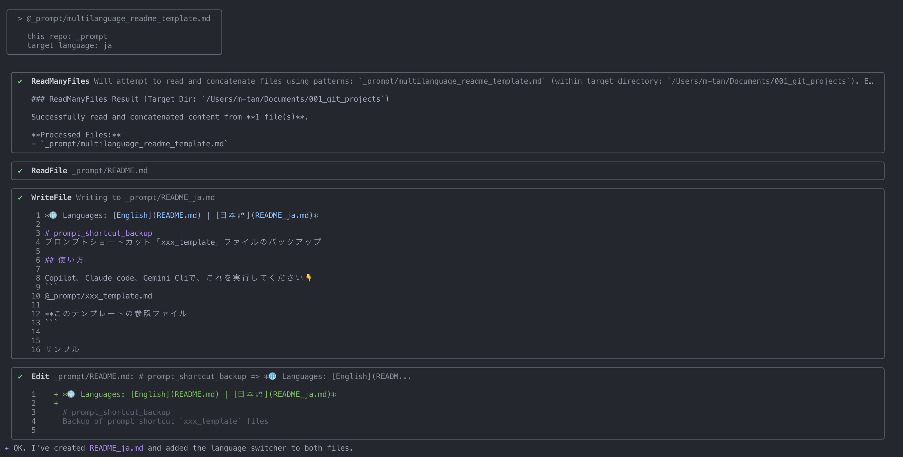

🌐 **Languages:** [English](README.md) | [日本語](README_ja.md)

## 🚀 クイックスタート

### プロジェクトでテンプレートを使用する

#### シンボリックリンクの作成（推奨）

**なぜシンボリックリンクを使うのか？**
- **📁 Single Source of Truth**: テンプレートを一箇所で集中管理
- **🔄 自動更新**: テンプレートの改善が全プロジェクトに即座に反映
- **🚫 重複なし**: 複数プロジェクトでのコピー管理を回避
- **✅ バージョン一貫性**: 全プロジェクトで同じテンプレートバージョンを保証


**ユースケース例：**
同じプロンプトテンプレートを使用する10個のプロジェクトがあると想像してください。シンボリックリンクなしでは：
- 10個のプロジェクトすべてにテンプレートをコピー（10倍のストレージ）
- テンプレートを改善する際、10個すべてを更新（10倍の作業）
- プロジェクト間でバージョンが異なるリスク（不整合）

シンボリックリンクを使えば：
- テンプレートを1箇所で管理
- 一度更新すれば、全プロジェクトが即座に恩恵を受ける
- 全プロジェクトで一貫性を保証

```bash
# プロジェクトへ移動
cd ~/workspace/your-project

# メインテンプレートへのシンボリックリンクを作成
# ln -s ~/Documents/001_git_projects/_prompt/main _prompt_alias
ln -s ~{YOUR_(_prompt/main)_PATH} _prompt_alias

# @_prompt/template_name.md を使用してテンプレートを参照できます
```

## 使い方

Claude Codeでこれを実行してください 👇
```
@_prompt/xxx_template.md

**このテンプレートの参照ファイル
```

### サンプル
